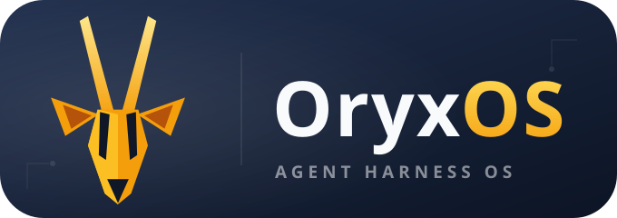
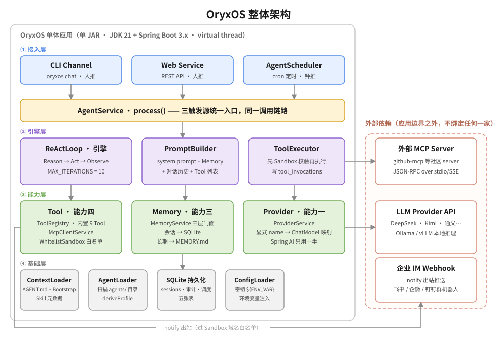

<p align="center">
  
</p>

# OryxOS

**企业 Agent 操作系统（Agent Harness OS）—— 让每一家公司，都能用自然语言跑起来自己的 Agent。**

[](https://openjdk.org/)
[](https://spring.io/projects/spring-boot)
[](LICENSE)
[](#项目状态)
[](docs/oryx-labs.md)
[](https://wngbob.github.io/oryxos/)

---

## 简介

OryxOS 是企业私有部署的 **Agent 操作系统**：装在企业自己的 K8s、虚拟机或物理机上，作为统一底座运行各类业务 Agent（运维助手、客服助手、HR 助手、销售助手、知识管理助手……），共享渠道接入、模型路由、工具调用、记忆系统、沙箱执行能力。**数据完全留在企业自己的基础设施，不锁任何云生态。**

我们的判断是：让 Agent 在生产环境可靠工作，瓶颈通常不在模型本身，而在 **Agent 的运行环境**。OryxOS 做的不是又一个 Agent，而是让一群 Agent 可靠运行和协同的底座本身。

**北极星公式**：`自然语言(md) + Memory + Tool + MCP(Connector) + Skill + 知识库 + Notify = 一个 Agent`

## 为什么需要 OryxOS

每家公司都有该交给 Agent 的活，但 Agent 大多还停在 demo，卡在四道门槛上：

| 门槛 | OryxOS 的解法 |
|------|--------------|
| 定义一个 Agent 要写代码，最懂业务的人反而做不了 | **自然语言定义**：一个包含 `AGENT.md` 的目录就是一个 Agent，零代码 |
| 云平台要把数据拿走，合规过不去 | **私有部署**：数据不出域，装在自己机器上 |
| 执行是黑盒，企业不敢上生产 | **全链路审计 + 沙箱**：每次 LLM/Tool 调用落库可查，白名单强制隔离 |
| 跑一个容易、跑一群难 | **Agent Harness OS**：为一整队 Agent 准备的生命周期与治理 |

## Agent OS 与 Agent runtime 的区别

这两个概念常被混用，但它们是两层东西：

- **Agent runtime**：让**单个** Agent 跑起来的执行内核——LLM 调用、工具执行、上下文管理、循环控制
- **Agent OS（Agent Harness OS）**：内核包含一个 runtime，但在其之上还要管**一群** Agent——多 Agent 的生命周期、统一的对外渠道与对内接入、统一的记忆、多租户与审计治理

借操作系统类比：runtime 像单个进程的执行环境，Agent OS 像管理一群进程、调度资源、提供共享服务和治理的那一层。一句话：**runtime 让一个 Agent 跑起来，Agent OS 让一群 Agent 在企业里被管起来。** OryxOS 是后者。

跟相邻三类东西的边界：

| | 产物 | 谁来用 | 与 OryxOS 的关系 |
|---|------|--------|-----------------|
| Agent 框架（LangChain、Spring AI） | 代码（库 / SDK） | 开发者写代码 | **复用**：OryxOS 的 LLM 调用层直接复用 Spring AI Alibaba |
| 编排平台（Dify、Coze） | 可执行的 workflow 流程 | 业务/开发者拖拽编排 | **互补**：编排平台可跑在 OryxOS 之上当应用层 |
| 大厂中台 / SaaS | 完整应用 | 业务人员 | **替代**：OryxOS 开源、可私有部署、不锁任何云生态 |
| **Agent OS（OryxOS）** | **配置出来的常驻 Agent** | 业务方配置 + 开发者写 Tool | —— |

一句话总结：框架给你材料自己盖房子；编排平台编排的是"流程"；OryxOS 是盖好的房子——一个让 Agent 常驻、可治理、可审计地跑起来的底座。

## 核心特性

- 🤖 **一个目录 = 一个 Agent**：`AGENT.md`（frontmatter 运行配置 + 正文任务指令）定义一个 Agent，不写代码，多 Agent 同实例并存
- ☕ **Java 原生**：JDK 21 + Spring Boot 3.x，单可执行 JAR 部署，无缝复用企业现有 Java 运维工具链（Nacos、Sentinel、SkyWalking、Arthas、Prometheus + Grafana）
- 🔒 **私有可控**：数据不出企业，不绑任何云；面向严监管行业（银行、政府、电信、能源、医疗）的确定性选择
- 🛡️ **安全是地基不是补丁**：工具白名单沙箱、凭证不落地走环境变量/企业密钥体系、`tool_invocations` / `llm_calls` 审计表 Day One 落库
- 🧠 **自实现 ReAct 引擎**：核心推理循环自己实现，不套外部 Agent 框架，循环行为完全可控
- 🔌 **对接开放标准**：工具用 MCP、Agent 协作用 A2A、Agent 目录借 Anthropic Agent Skills 目录形态，与生态协同不另立协议
- 🧩 **三档工具扩展**：零代码 Agent 目录 + 复用 MCP（主推）→ 任何语言自写 MCP server → `@Tool` Java Bean，按门槛自由选择
- 💾 **跨对话记忆**：会话记忆 + 长期记忆两层（`MEMORY.md`），接口预留向量检索升级空间
- 🌐 **无状态可扩展**：实例无状态、状态外置，从架构第一天为分布式留好路

## 五大核心能力

| 能力 | 说明 |
|------|------|
| **对接 LLM** | Provider 抽象统一对接主流大模型（DeepSeek、通义、Kimi、智谱、混元、豆包、Anthropic、OpenAI…），Agent 不感知厂商，运行时切换无锁定，支持本地推理（Ollama、vLLM） |
| **ReAct 循环** | Agent 的推理引擎：LLM 思考 → 调工具 → 看结果 → 再决定，直到给出最终响应；自实现、行为完全可控 |
| **Memory 记忆** | 会话 + 长期两层记忆，跨对话记住用户偏好、项目背景、关键决策 |
| **Tool 工具体系** | 内置文件 / Shell / HTTP / 记忆 / 通知 9 个工具，Plugin Tool 三档扩展 |
| **Web Service** | 全部能力通过 REST API 对外暴露，任何能发 HTTP 的语言都能接入 |

## 架构



- **三触发源统一入口**：CLI / Web Service（人推）与 AgentScheduler（钟推）汇入同一个 `AgentService`，ReActLoop 不感知消息来源
- **引擎调度三能力**：`ReActLoop` 每轮经 `PromptBuilder` 组装上下文、经 `ProviderService` 调 LLM、经 `ToolExecutor`（先 Sandbox 白名单校验）执行工具，审计随调用落库
- **存储下沉**：Session、审计、调度状态落 SQLite；Agent 目录、Bootstrap、`MEMORY.md` 落文件系统——可直接编辑、git 可跟踪
- **外部依赖全部在边界之外**：LLM API、外部 MCP server、企业 IM webhook，OryxOS 不绑定任何一家

## 设计原则

- **底座优先于 Agent**：最重要的交付不是某个强大的 Agent，而是让任意 Agent 都能可靠运行的环境
- **自实现核心，可控优先**：核心推理循环自己实现；底层模型协议适配复用成熟库（Spring AI Alibaba，仅用协议转换 + `@Tool` schema 生成），不重复造轮子
- **配置即 Agent**：一个 Agent 由一份配置（一个目录）定义，而不是由代码写出
- **对接开放标准**：工具用 MCP、协作用 A2A、技能用开放格式，与生态协同，不另立协议
- **无状态实例，状态外置**：从单机平滑走向分布式的前提
- **安全是地基不是补丁**：工具来源受控、最小权限、强制沙箱、凭证不落地、全链路可审计，安全从第一天就在架构里
- **分阶段克制**：当前只做运行时内核的最小完备集，治理与重型分布式基础设施留到后续，每次架构升级都用真实使用数据证明其必要性

## 快速开始

> ⚠️ **项目处于开发早期**：设计文档已定稿，代码正在按路线图推进，以下命令为即将提供的形态预览。

```bash
# 环境要求：JDK 21+，Maven 3.8+

# 构建
mvn clean package

# 初始化工作区（创建 .oryxos/ 目录，幂等）
oryxos init

# 创建一个 Agent（生成 .oryxos/agents/<name>/AGENT.md 最小模板）
oryxos profile create my-assistant

# 交互式对话
oryxos chat

# 或启动 REST API 服务（默认端口 8080，OpenAPI 文档在 /swagger-ui）
oryxos serve
```

定义一个每日天气 Agent，只需要在 `.oryxos/agents/daily-weather/AGENT.md` 里写：

```markdown
---
name: daily-weather
provider: { name: deepseek, model: deepseek-chat }
tools: [http_get, notify]
schedules: [{ cron: "0 0 8 * * *", message: "查一下今天天气并生成穿搭建议" }]
---

每天早上自动查天气、生成穿搭建议，通过 notify 推送到团队群（渠道名 team-lark）。
```

不写一行代码，到点自动运行，每次调用都有审计记录。

## 项目状态

**当前阶段：设计文档已定稿，运行时内核开发中。**

- [x] 业界调研 / 需求文档 / 技术方案 / AI 编程指南
- [x] Spec-Kit 开发工作流搭建
- [ ] 核心阶段：五大核心能力（9 个 Maven 模块，运行时内核）
- [ ] 三个验收 Demo：每日天气 / 每日科技日报 / 每日 GitHub 日报
- [ ] OryxOS 1.0 发布 + 项目主页

## 路线图

我们的开发理念是：**慢就是快，克制且聚焦**。先把单机的运行时内核做扎实，再逐步生长出分布式能力。

- **阶段一（当前）单机运行时内核**：五大核心能力跑通，配置即 Agent、多 Agent 并存、REST API 接入、对接 MCP
- **阶段二（规划）底座分布式**：节点无状态化、状态外置、多副本部署，支撑更大规模与高可用
- **阶段三（愿景）跨节点 Agent 协作**：引入 Agent 通信底座，对接 A2A，跨节点发现、委托、可靠异步协同
- **横向能力**（伴随各阶段补齐）：多租户、SSO、完整审计、工具策略、可观测、Web 管理台

**长期目标：走进 Apache 基金会，成为 Apache 顶级项目。**

## 文档

| 文档 | 内容 |
|------|------|
| [官网](https://wngbob.github.io/oryxos/) | 项目官网（VitePress，中英文双语，源码在 `website/`） |
| [业界调研](docs/IndustryResearch.md) | Agent OS 是什么、业界格局、Java 生态缺位、OryxOS 定位 |
| [需求文档](docs/DemandAnalysis.md) | 五大核心能力、三档需求、验收标准 |
| [技术方案](docs/TechnicalSolution.md) | 技术栈、关键技术决策、模块结构、数据模型 |
| [AI 编程指南](docs/AiProgrammingGuide.md) | Spec-Kit 开发流程、user story 拆解 |
| [项目宣言](docs/oryxos.md) | OryxOS 的愿景与完整叙事 |
| [CLAUDE.md](CLAUDE.md) | AI agent 在本仓库工作时的必读上下文（架构原则与红线） |

## 参与贡献

OryxOS 由 [oryx-labs](docs/oryx-labs.md) 社区孵化——一个 AI coding 驱动的 AI 探索社区。

- 主体开发采用 **Spec-Driven Development**（Spec-Kit）：`specify → plan → tasks → implement`，核心原则见 [CLAUDE.md](CLAUDE.md) 与 `.specify/memory/constitution.md`
- 增量贡献（修 bug、加 Plugin Tool、补文档）：直接在已有代码上改，提 PR 即可
- 贡献前请先读 [CLAUDE.md](CLAUDE.md) 的「不可违背的原则」一节——违反红线的代码必须返工

## 致谢

OryxOS 借鉴了开源社区已被验证的设计：[OpenClaw](https://github.com/openclaw/openclaw) 与 [Hermes Agent](https://github.com/NousResearch/hermes-agent) 的 Agent OS 形态、[Anthropic Agent Skills](https://agentskills.io) 的目录 + 渐进式披露、[Model Context Protocol](https://modelcontextprotocol.io) 的工具协议、[Spring AI Alibaba](https://java2ai.com) 的 LLM connector。

## License

[Apache License 2.0](LICENSE)
